<p align="right"></p>

<h1 align="center">Hi There! 👋, I'm Fahad<h3 align="center">🧠 Premium Software Engineer </h3></h1>

<p align="right"> 
        <a href="https://www.linkedin.com/in/fahadbinhussain/" target="_blank"></a>
        <a href="mailto:fahadbinhussain001@gmail.com"></a>
        <a href="https://github.com/sponsors/fahadbinhussain" target="_blank"></a>
        <a href="https://www.buymeacoffee.com/fahadbinhu6" target="_blank"></a>          
</p>

<p align="right"> 
        <a href="https://oangrybird.onrender.com/" target="_blank"></a>
        <a href="https://algoject.statuspage.io/" target="_blank"></a>
</p>

<div style="padding-left: 20px;">
        <h3>🤝 Seeking Employment Opportunities</h3>
<details open><summary>📫 <b>Let's get in touch</b></summary>
<p> 🎯 Connect with me on <a href="https://www.linkedin.com/in/fahadbinhussain/" target="_blank">
        </a></p>
<p> ✉ Email me at: <a href="mailto:fahadbinhussain001@gmail.com"><strong>fahadbinhussain001 [at] gmail.com</strong></a> (No spam or marketing please!)</p>
        </details>
</div>

<details open> <summary><h3>🚀 About Me</h3></summary>

- 🎓 I am pursuing a Bachelor of Science in Computer Science and Engineering.
- 🔭 Currently actively developing my [Mojify](https://github.com/FahadBinHussain/Mojify), [Algovian](https://github.com/FahadBinHussain/Algovian) & [Islam](https://github.com/FahadBinHussain/Islam) projects.
- 🤝 I’m looking for assistance with my [DotsAndBoxesMipsAssemblyEdition](https://github.com/FahadBinHussain/DotsAndBoxesMipsAssemblyEdition) repository.
- 🌱 I’m currently further expanding my knowledge in **C++**
- ⚡ Fun fact **I love eating spicy food 🌶️ & talking about space🌌🧑‍🚀**

</details>

<details open> <summary><h3>📊 Weekly Development Breakdown</h3></summary>

<!--START_SECTION:waka-->

```txt
From: 15 April 2026 - To: 22 April 2026

Total Time: 22 hrs 16 mins

Unknown      11 hrs 27 mins        █████████████░░░░░░░░░░░░   51.40 %
YAML         2 hrs 16 mins         ██▓░░░░░░░░░░░░░░░░░░░░░░   10.18 %
TSX          2 hrs 1 mins          ██▒░░░░░░░░░░░░░░░░░░░░░░   09.04 %
JSX          1 hrs 33 mins         █▓░░░░░░░░░░░░░░░░░░░░░░░   06.95 %
Markdown     1 hrs 12 mins         █▒░░░░░░░░░░░░░░░░░░░░░░░   05.38 %
```

<!--END_SECTION:waka-->

</details>

<div markdown="1" style="display: flex;">
<details open>
    <summary><h3 align="left">📈 My Github Stats:</h3></summary>
    <picture>
      <source media="(prefers-color-scheme: dark)" srcset="https://gitbio.vercel.app/api?username=fahadbinhussain&show_icons=true&theme=radical">
      <source media="(prefers-color-scheme: light)" srcset="https://gitbio.vercel.app/api?username=fahadbinhussain&show_icons=true">
      
    </picture>
    <picture>
      <source media="(prefers-color-scheme: dark)" srcset="https://gitbio.vercel.app/api/top-langs/?username=fahadbinhussain&theme=radical&layout=compact">
      <source media="(prefers-color-scheme: light)" srcset="https://gitbio.vercel.app/api/top-langs/?username=fahadbinhussain&layout=compact">
      
    </picture>
    <picture>
      <source media="(prefers-color-scheme: dark)" srcset="https://gitstreak.vercel.app/?user=fahadbinhussain&theme=radical&cache_seconds=1800&v=20260420">
      <source media="(prefers-color-scheme: light)" srcset="https://gitstreak.vercel.app/?user=fahadbinhussain&cache_seconds=1800&v=20260420">
      
    </picture>
    <picture>
      <source media="(prefers-color-scheme: dark)" srcset="https://gitrophy.vercel.app/?username=FahadBinHussain&theme=tokyonight&column=4">
      <source media="(prefers-color-scheme: light)" srcset="https://gitrophy.vercel.app/?username=FahadBinHussain&column=4">
      
    </picture></p>
</details>


<picture>
  <source media="(prefers-color-scheme: dark)" srcset="https://raw.githubusercontent.com/FahadBinHussain/FahadBinHussain/output/github-contribution-grid-snake-dark.svg">
  <source media="(prefers-color-scheme: light)" srcset="https://raw.githubusercontent.com/FahadBinHussain/FahadBinHussain/output/github-contribution-grid-snake.svg">
  
</picture>

</div>
<details open>
  <summary><h3>🔧 Languages & Tools I Primarily Use</h3></summary>
  
  
<!--START_SECTION:stack-->

**Languages**

       

**Tools & Frameworks**

           

<!--END_SECTION:stack-->
</details>

<details>
  <summary><h3>📌More Stats</h3></summary>
  <div style="display: flex; flex-wrap: wrap;">
          <details open>
          <summary><h4>💫 Repo Star Data</h4></summary>
                
          </details>
          <details>
          <summary><h4>💫 Repo Star Data</h4></summary>
                
          </details>
          <details>
          <summary><h4>📝 Habits</h4></summary>
                
          </details>
          <details>
          <summary><h4>📂 Featured Repos</h4></summary>
                
          </details>
  </div>
</details>


<!-- [](https://skillicons.dev)<br/> -->
<!-- -->
